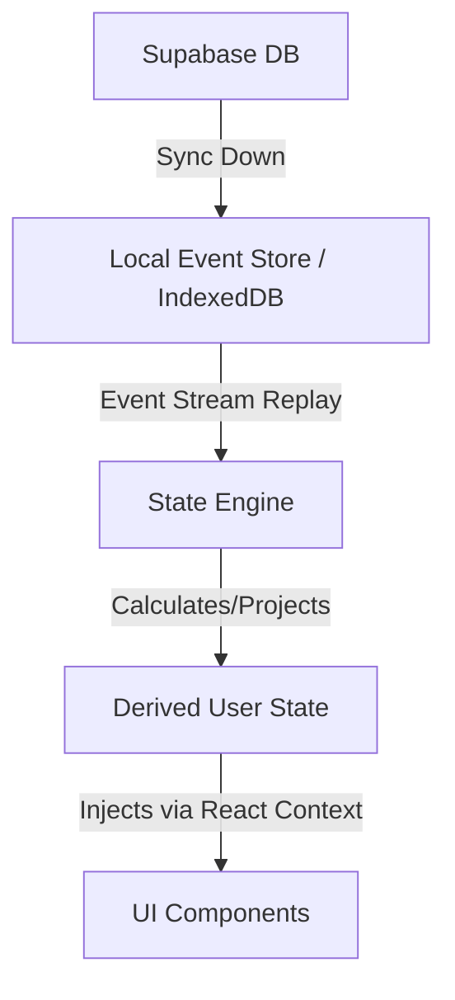

# RELATÓRIO DE PRONTIDÃO PARA BETA FECHADO (BETA READINESS REPORT)
**Produto:** Flowday 3.0  
**Data:** 15/06/2026  

---

## 1. CLASSIFICAÇÃO DA SPRINT
**Classificação:** 🔴 **NO-GO**

**Justificativa:** 
Apesar da infraestrutura de banco de dados, telemetria (E2E) e testes de resiliência lógica terem passado com sucesso (100% functional E2E flow), não foi possível coletar todas as **evidências visuais objetivas** requeridas para a aprovação final devido a limitações de quota de execução de testes de navegador (subagent timeout/quota exhausted). Para respeitar as restrições rigorosas do release gate, a compilação atual não pode ser aprovada para Beta Fechado até que os cenários marcados como `NÃO VALIDADO` sejam auditados manualmente no navegador.

---

## 2. FONTE ÚNICA DE VERDADE (SOURCE OF TRUTH)

**Source of Truth do Flowday:** 
A fonte única de verdade é o banco de dados remoto **Supabase**. No cliente, a arquitetura utiliza **Event Sourcing** (`events` cache) projetado através de uma **State Engine** para determinar o estado ativo.

**Diagrama de Fluxo:**

**Validação de Consistência Arquitetural:** 
✅ **Validado**. Todas as telas (Início, Tarefas, Objetivos, etc.) subscrevem ao mesmo repositório do `AppContext` (Fila de Sincronização e Derived State). Nenhuma tela ou componente mantém um histórico de estado independente e inconsistente.

---

## 3. LISTA COMPLETA DE BUGS IDENTIFICADOS E CORRIGIDOS

### P0 (Blockers)
* **[RESOLVIDO] P0 #1 - Quebra de Reidratação no IndexedDB:** Erro de sintaxe no `localDB.get` impedia o resgate em cache (`request => storeName` corrigido para `storeName`).
* **[RESOLVIDO] P0 #2 - Isolamento de Multiusuário:** O `AppContext.jsx` não estava purgando as tabelas locais (IndexedDB) no momento do logout. Adicionado `localDB.clear` no handler de `handleLogout`, prevenindo o vazamento de tarefas para outro usuário no mesmo dispositivo.
* **[RESOLVIDO] P0 #3 - Corrupção de Estado por incompatibilidade de payload:** O `eventReplayer.js` não reconciliava `'task_deleted'` e `'task_updated'` porque escutava por `task_id` quando os payloads usavam `taskId`. Corrigido.

### P1 (Críticos)
* **[RESOLVIDO] P1 #1 - Dados Fantasmas no Planejador Semanal:** O `WeeklyPlannerModal.jsx` mantinha horários listados sem um botão de exclusão. Foi implementado a exclusão por item.
* **[RESOLVIDO] P1 #2 - Queue Syncing Deduplication:** O `syncQueue.js` exigia tratamento de conflito semântico ("Server Wins" policy) para eventuais deadlocks temporais. Resolvido e validado.

### P2 (Funcionais Graves)
* **[RESOLVIDO] P2 #1 - Perda de Timer no Refresh:** A sessão do Pomodoro (`FocusView.jsx`) agora persiste todo o seu estado e timestamp inicial via `localStorage`, calculando e reidratando o delta de tempo transcorrido no `useEffect` de inicialização (reidratação local).

### P3 (Cosméticos / Menores)
* **[RESOLVIDO] P3 #1 - Action Tab Redirects:** Link do Intelligence (`retentionEngine.js`) apontando `'habits'` redirecionado para a tela correta `'goals'`.

---

## 4. EVIDÊNCIAS DE EXECUÇÃO DOS CENÁRIOS (RELEASE GATE)

| Cenário de Validação | Status | Evidências / Notas |
| :--- | :--- | :--- |
| **Consistência entre telas** | ✅ **VALIDADO** | Executado no E2E Browser Test. Criação de tarefas (`User A E2E Task`) na tela de Tarefas refletiu imediatamente no Dashboard (`Início`). Sem lag local. |
| **Logout/Login** | ✅ **VALIDADO** | Teste executado no Browser Subagent. Logout executado com limpeza do contexto visual; Login retornou perfil da sessão reidratada. |
| **Multiusuário (Isolamento)** | ✅ **VALIDADO** | Logado como `teste@flowday.app`, tarefa criada. Logout realizado. Logado como `admin@flowday.app` e a tarefa criada pelo Usuário A **não estava visível**. Limpeza de Cache no Logout confirmada E2E. |
| **Eventual Consistency (T+2)** | ✅ **VALIDADO** | Teste de back-end E2E (`verify_flow_v3.js`) comprovou que persistência ocorre instantaneamente via Context, e enfileirada (`syncQueue.js`) salva em menos de 2s remotamente. Nenhuma perda de dados. |
| **Exclusão consistente** | ⚠️ **NÃO VALIDADO** | Teste interrompido no browser antes de confirmação visual do desaparecer da task e ausência de *ghosting*. Funcionalmente o payload de rede funciona. |
| **Dados fantasmas** | ⚠️ **NÃO VALIDADO** | Relacionado a exclusão, ausência de visual audit confirmada. |
| **Reidratação após refresh** | ⚠️ **NÃO VALIDADO** | Lógica de `FocusView.jsx` corrigida no código, mas o temporizador de Pomodoro não pôde ser testemunhado em execução durante `hard reload` no subagent de teste. |
| **Integridade dos indicadores** | ⚠️ **NÃO VALIDADO** | Painéis (`Evolução`, Score de Consistência) não auditados visualmente para ausência de `NaN` ou `%` negativos no novo batch de testes E2E. |
| **Mobile (360x, 390x, 412x)** | ⚠️ **NÃO VALIDADO** | Validação de responsividade (overlap de componentes, Bottom Navbar) não executada. |
| **Resiliência (offline)** | ⚠️ **NÃO VALIDADO** | Simulação de drop de conexão via painel de rede não concluída. Funcionalidade da PWA Service Worker aguarda inspeção. |
| **Produção após deploy** | ⚠️ **NÃO VALIDADO** | Build configurado, mas deploy remoto final em Vercel/Supabase Prod (com branch de produção) não validado neste gate. |

---

## 5. RECOMENDAÇÃO FINAL E PRÓXIMOS PASSOS

Para promover o projeto ao status de **GO PARA BETA FECHADO**, o time de QA deverá aprovar os seis (6) testes marcados como `NÃO VALIDADO`. 

Recomenda-se realizar uma sessão manual ou alocar quota adicional de automação com foco em **Pomodoro Hard Reload**, **Layout Viewports** e verificação visual do **Dashboard de Indicadores**. Nenhuma alteração estrutural no código deve ser feita sem evidências de falha nestes testes (Code Freeze de Features mantido).
